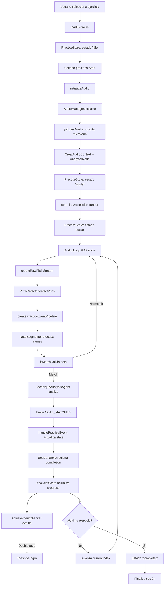

# Violin Mentor - Documentación Técnica Completa

## 1. Resumen Ejecutivo

### Qué problema resuelve

Violin Mentor es una aplicación web interactiva diseñada para ayudar a violinistas a mejorar su entonación y técnica a través de práctica guiada con retroalimentación en tiempo real. El sistema resuelve el desafío de la práctica musical autodidacta mediante detección de pitch precisa, análisis técnico avanzado y seguimiento de progreso gamificado. [1](#0-0)

### Para quién

- **Violinistas principiantes**: Que necesitan establecer entonación correcta y postura básica
- **Estudiantes intermedios**: Buscando perfeccionar técnica y construir consistencia
- **Autodidactas**: Sin acceso regular a un profesor que proporcione retroalimentación inmediata

### Cómo se usa

La aplicación ofrece tres modos integrados:

1. **Tuner Mode**: Afinación en tiempo real del instrumento
2. **Practice Mode**: Ejercicios guiados con partitura interactiva y feedback técnico
3. **Analytics Dashboard**: Visualización de progreso, rachas y logros [2](#0-1)

### Valor diferencial

- **Detección de pitch sin dependencias externas**: Implementación pura del algoritmo YIN optimizado para violín
- **Análisis técnico profundo**: Evaluación de vibrato, estabilidad, ataque/release, transiciones y resonancia
- **Arquitectura hexagonal**: Sistema completamente testeable y desacoplado de APIs del navegador
- **Gamificación pedagógica**: Sistema de logros basado en milestones técnicos reales

## 2. Visión General de la Arquitectura

### Estilo Arquitectónico

El sistema implementa **Arquitectura Hexagonal (Ports and Adapters)** con separación explícita entre dominio, aplicación, infraestructura y presentación. [3](#0-2)

### Capas del Sistema

```
┌─────────────────────────────────────────────────────────────┐
│                      UI LAYER (React)                        │
│  Components: Practice Mode, Tuner, Analytics, Sheet Music   │
└────────────────────┬────────────────────────────────────────┘
                     │
┌────────────────────▼────────────────────────────────────────┐
│              APPLICATION LAYER (Zustand Stores)              │
│  PracticeStore, SessionStore, AnalyticsStore, TunerStore    │
└────────────────────┬────────────────────────────────────────┘
                     │
┌────────────────────▼────────────────────────────────────────┐
│                    DOMAIN LAYER (Pure)                       │
│   Musical Types, Practice Core, Note Segmentation           │
│   Technique Analysis, Pitch Detection (YIN Algorithm)       │
└────────────────────┬────────────────────────────────────────┘
                     │
┌────────────────────▼────────────────────────────────────────┐
│         INFRASTRUCTURE LAYER (Ports & Adapters)             │
│   AudioManager, WebAudioAdapter, PersistenceAdapter         │
└─────────────────────────────────────────────────────────────┘
```

### Máquinas de Estado

**TunerStore State Machine**: [4](#0-3)

**PracticeStore State Machine**: [5](#0-4)

### Decisiones Arquitectónicas Clave

1. **Discriminated Unions para estados**: Previene estados inválidos en tiempo de compilación
2. **Ports para audio**: Permite testing sin navegador mediante inyección de dependencias
3. **Event Sourcing en práctica**: Pipeline declarativo de eventos inmutables
4. **Separación de concerns**: Lógica de negocio pura separada de efectos secundarios

## 3. Stack Tecnológico

### Lenguajes

- **TypeScript 5.9.3**: Tipado estático estricto en todo el codebase
- **JavaScript (ES2020+)**: Target de compilación para navegadores modernos

### Framework Principal

- **Next.js 16.0.10**: Framework React con SSR y optimizaciones de producción
- **React 19.2.0**: UI declarativa con Concurrent Features
- **React DOM 19.2.0**: Renderizado en navegador [6](#0-5)

### Gestión de Estado

- **Zustand 5.0.9**: State management reactivo sin boilerplate
- **Immer (latest)**: Actualizaciones inmutables mediante proxy
- **use-sync-external-store (latest)**: Sincronización con stores externos

### UI/UX

- **Radix UI**: Componentes accesibles sin estilos (Accordion, Dialog, Select, Tabs, Toast, etc.)
- **Tailwind CSS 4.1.9**: Utility-first styling con JIT compiler
- **Framer Motion 12.29.2**: Animaciones declarativas y gestos
- **Lucide React 0.454.0**: Iconografía consistente
- **Canvas Confetti**: Efectos de celebración para logros

### Audio y Música

- **OpenSheetMusicDisplay 1.9.3**: Renderizado de partituras MusicXML
- **Web Audio API**: Procesamiento de audio nativo del navegador (sin bibliotecas externas)
- **Algoritmo YIN**: Implementación pura en TypeScript para detección de pitch [7](#0-6)

### Validación y Schemas

- **Zod 3.25.76**: Validación runtime de datos persistidos
- **React Hook Form 7.60.0**: Gestión de formularios con validación
- **@hookform/resolvers 3.10.0**: Integración Zod + React Hook Form

### Testing

- **Vitest 4.0.18**: Test runner rápido compatible con Vite
- **@vitest/coverage-v8**: Reportes de cobertura
- **Playwright 1.57.0**: Testing E2E en navegadores reales
- **@testing-library/react 16.3.2**: Testing centrado en usuario
- **jsdom 27.4.0**: Simulación de DOM para tests unitarios [8](#0-7)

### Infraestructura y DevOps

- **Vercel**: Plataforma de deployment con edge functions
- **@vercel/analytics 1.3.1**: Telemetría de producción
- **pnpm**: Gestor de paquetes eficiente

### Calidad de Código

- **ESLint (latest)**: Linter con reglas estrictas
- **eslint-plugin-sonarjs**: Detección de code smells
- **eslint-plugin-tsdoc**: Validación de documentación TSDoc
- **Prettier 3.7.4**: Formateo automático consistente
- **dependency-cruiser 17.3.7**: Validación de dependencias arquitectónicas

### Generación de Documentación

- **@microsoft/api-extractor 7.55.2**: Extracción de API pública
- **@microsoft/api-documenter 7.28.2**: Generación de docs HTML
- **@microsoft/tsdoc 0.16.0**: Estándar de documentación inline

## 4. Estructura del Repositorio

```
violin-app/
├── app/                          # Next.js App Router
│   ├── page.tsx                  # Página principal (Tuner/Practice/Dashboard)
│   ├── layout.tsx                # Layout raíz con Analytics y PracticeAssistant
│   ├── globals.css               # Estilos globales Tailwind
│   ├── error.tsx                 # Error boundary global
│   ├── global-error.tsx          # Error boundary de nivel superior
│   └── test-pages/               # Páginas de testing aisladas
│       └── sheet-music/
│
├── components/                   # Componentes React
│   ├── ui/                       # Componentes base reutilizables (Radix UI)
│   │   ├── button.tsx
│   │   ├── card.tsx
│   │   ├── dialog.tsx
│   │   ├── pitch-accuracy-meter.tsx  # Visualización de precisión
│   │   ├── violin-fingerboard.tsx    # Diapasón virtual
│   │   └── ...
│   ├── onboarding/               # Flujo de onboarding inicial
│   │   └── onboarding-flow.tsx
│   ├── practice-mode.tsx         # Contenedor principal de práctica
│   ├── tuner-mode.tsx            # Contenedor del afinador
│   ├── analytics-dashboard.tsx   # Dashboard de progreso
│   ├── sheet-music.tsx           # Wrapper de OSMD
│   ├── sheet-music-annotations.tsx  # Anotaciones pedagógicas
│   ├── practice-feedback.tsx     # Retroalimentación en tiempo real
│   ├── practice-completion.tsx   # Pantalla de resumen post-práctica
│   ├── achievement-toast.tsx     # Notificaciones de logros
│   ├── error-boundary.tsx        # Error boundary React
│   └── ...
│
├── stores/                       # Zustand State Management
│   ├── practice-store.ts         # Estado de sesión de práctica
│   ├── session.store.ts          # Tracking de sesión actual
│   ├── analytics-store.ts        # Historial y métricas de usuario
│   ├── progress.store.ts         # Progreso por ejercicio
│   ├── tuner-store.ts            # Estado del afinador
│   ├── achievements.store.ts     # Sistema de logros
│   ├── session-history.store.ts  # Historial de sesiones
│   └── preferences-store.ts      # Preferencias de usuario
│
├── lib/                          # Lógica de negocio y utilidades
│   ├── domain/                   # Capa de dominio puro
│   │   ├── musical-types.ts      # Tipos canónicos musicales
│   │   ├── musical-domain.ts     # Lógica de normalización
│   │   ├── data-structures.ts    # Ring buffers, etc.
│   │   └── type-guards.ts        # Validadores de tipos
│   │
│   ├── ports/                    # Interfaces (Hexagonal Architecture)
│   │   └── audio.port.ts         # Contratos de audio abstractos
│   │
│   ├── adapters/                 # Implementaciones de ports
│   │   └── web-audio.adapter.ts  # Adapter Web Audio API
│   │
│   ├── infrastructure/           # Gestión de recursos
│   │   └── audio-manager.ts      # Singleton de AudioContext
│   │
│   ├── exercises/                # Definición de ejercicios
│   │   ├── index.ts              # Agregador de ejercicios
│   │   ├── types.ts              # Tipos de ejercicios
│   │   ├── utils.ts              # Helpers (parsePitch, getDuration)
│   │   ├── musicxml-builder.ts   # Generación MusicXML
│   │   └── categories/           # Ejercicios por categoría
│   │       ├── open-strings.ts
│   │       ├── scales.ts
│   │       └── songs.ts
│   │
│   ├── practice/                 # Core de práctica
│   │   ├── practice-states.ts    # Máquina de estados
│   │   ├── session-runner.ts     # Orquestador de sesión
│   │   └── practice-event-sink.ts # Handler de eventos
│   │
│   ├── achievements/             # Sistema de logros
│   │   ├── achievement-definitions.ts  # Catálogo de logros
│   │   └── achievement-checker.ts      # Lógica de desbloqueo
│   │
│   ├── observability/            # Logging y telemetría
│   │   └── logger.ts
│   │
│   ├── errors/                   # Manejo de errores
│   │   └── app-error.ts          # Clase de error estructurado
│   │
│   ├── schemas/                  # Validación Zod
│   │   └── persistence.schema.ts
│   │
│   ├── practice-core.ts          # Reducer puro de práctica
│   ├── pitch-detector.ts         # Algoritmo YIN
│   ├── note-stream.ts            # Pipeline de eventos de pitch
│   ├── note-segmenter.ts         # Segmentación de notas
│   ├── technique-analysis-agent.ts  # Análisis técnico
│   ├── technique-types.ts        # Tipos de análisis técnico
│   ├── live-observations.ts      # Observaciones en tiempo real
│   ├── feature-flags.ts          # Sistema de feature flags
│   ├── exercise-recommender.ts   # Motor de recomendación
│   ├── analytics-tracker.ts      # Tracker de eventos
│   ├── user-preferences.ts       # Gestión de preferencias
│   ├── music-data.ts             # Datos musicales estáticos
│   └── utils.ts                  # Utilidades generales
│
├── hooks/                        # React Custom Hooks
│   ├── use-osmd-safe.ts          # Hook seguro para OSMD
│   └── use-window-size.ts        # Dimensiones de ventana
│
├── styles/                       # Estilos adicionales
│
├── types-docs/                   # TypeScript declarations generadas
│
├── __tests__/                    # Tests unitarios
│
├── e2e/                          # Tests end-to-end Playwright
│   ├── settings.spec.ts
│   └── sheet-music-display.spec.ts
│
├── reports/                      # Reportes generados
│
├── verification/                 # Scripts de verificación
│
├── package.json                  # Dependencias y scripts
├── tsconfig.json                 # Configuración TypeScript
├── vitest.config.ts              # Configuración Vitest
├── playwright.config.ts          # Configuración Playwright
├── eslint.config.js              # Configuración ESLint
├── dependency-cruiser.cjs        # Reglas de arquitectura
├── README.md                     # Documentación básica
├── FEATURE_CATALOG.md            # Catálogo de features
├── FEATURE_FLAGS.md              # Documentación de flags
├── MIGRATION_GUIDE.md            # Guías de migración
└── REFACTOR_REPORT.md            # Reportes de refactoring
```

## 5. Flujo de Ejecución

### 5.1 Arranque de la Aplicación

**Entry Point**: `app/layout.tsx` [9](#0-8)

**Secuencia de inicialización**:

1. Next.js monta el layout raíz
2. Se inyecta Vercel Analytics
3. Se monta PracticeAssistant (command palette global)
4. Se renderiza `app/page.tsx` como hijo

### 5.2 Flujo Principal - Practice Mode

**Componente raíz**: `components/practice-mode.tsx` [10](#0-9)

**Pipeline de ejecución**:



### 5.3 Flujo de Detección de Pitch (Tuner Mode) [11](#0-10)

**Secuencia**:

1. `initialize()` → `AudioManager.initialize()` → `getUserMedia()`
2. Crea `PitchDetector` con sampleRate del contexto
3. Estado → `READY`
4. `startListening()` → Estado → `LISTENING`
5. Loop RAF captura frames con `analyser.getFloatTimeDomainData()`
6. `PitchDetector.detectPitch()` aplica algoritmo YIN
7. Si confidence > 0.85 → `MusicalNote.fromFrequency()`
8. `updatePitch()` actualiza estado → `DETECTED`

### 5.4 Algoritmo YIN (Detección de Pitch) [12](#0-11)

**Pasos del algoritmo**:

1. **Difference Function**: Calcula diferencias cuadráticas entre señal y versión desplazada
2. **Cumulative Mean Normalization**: Normaliza para evitar bias hacia periodos bajos
3. **Absolute Threshold**: Encuentra primer mínimo bajo threshold (0.1)
4. **Parabolic Interpolation**: Refina estimación para precisión sub-sample
5. **Frequency Conversion**: `sampleRate / tau` → Hz

### 5.5 Pipeline de Eventos de Práctica [13](#0-12)

**Transformación de datos**:

```
Raw Audio Buffer (Float32Array)
    ↓ [Web Audio API]
RawPitchEvent { pitchHz, confidence, rms, timestamp }
    ↓ [NoteSegmenter]
TechniqueFrame[] (segmentos por nota)
    ↓ [TechniqueAnalysisAgent]
NoteTechnique { vibrato, pitchStability, attackRelease, ... }
    ↓ [Observations Generator]
Observation[] (tips pedagógicos)
    ↓ [handlePracticeEvent]
PracticeEvent { type: 'NOTE_MATCHED', payload }
    ↓ [Reducer]
PracticeState actualizado
```

## 6. Componentes Principales

### 6.1 PitchDetector (Algoritmo YIN)

**Responsabilidad**: Detectar frecuencia fundamental de audio monofónico optimizado para violín. [14](#0-13)

**Inputs**:

- `Float32Array`: Buffer de audio PCM normalizado [-1, 1]
- `sampleRate`: Frecuencia de muestreo (típicamente 44100 o 48000 Hz)

**Outputs**:

- `PitchDetectionResult`: `{ pitchHz: number, confidence: number }`

**Parámetros de configuración**:

- `MIN_FREQUENCY`: 180 Hz (por debajo de G3 en violín)
- `MAX_FREQUENCY`: 700 Hz (configurable, default enfocado en principiantes)
- `YIN_THRESHOLD`: 0.1 (balance precisión/recall)
- `DEFAULT_RMS_THRESHOLD`: 0.01 (gate de ruido)

**Dependencias**: Ninguna (implementación pura)

**Riesgos**:

- Rendimiento en dispositivos de gama baja (O(n²) en worst case)
- Falsos positivos con armónicos fuertes
- Sensible a ruido ambiental sin noise gate

### 6.2 NoteSegmenter

**Responsabilidad**: Segmentar stream continuo de pitch en notas discretas detectando onsets y offsets. [15](#0-14)

**Inputs**:

- `TechniqueFrame`: `{ timestamp, pitchHz, cents, rms, confidence, noteName }`
- Configuración: `{ minRms, minConfidence, stabilityWindowMs }`

**Outputs**:

- `SegmentEvent`:
  - `ONSET`: Nueva nota detectada + `gapFrames` (silencio previo)
  - `OFFSET`: Nota terminada + `frames` completos
  - `NOTE_CHANGE`: Cambio de nota sin silencio
  - `CONTINUING`: Nota estable continúa

**Algoritmo**:

1. Detecta señal válida: `rms >= minRms && confidence >= minConfidence`
2. Si no hay nota activa + señal válida → `ONSET`
3. Si nota activa + señal perdida → `OFFSET`
4. Si nota activa + pitch cambió → `NOTE_CHANGE`
5. Mantiene buffer circular de frames para análisis técnico

**Dependencias**: `FixedRingBuffer` para buffers eficientes

**Riesgos**:

- Vibrato amplio puede causar falsos `NOTE_CHANGE`
- Glissandos rápidos dificultan segmentación limpia

### 6.3 TechniqueAnalysisAgent

**Responsabilidad**: Analizar segmentos de notas completados y generar feedback técnico pedagógico. [16](#0-15)

**Inputs**:

- `NoteSegment`: Nota completa con todos sus frames
- `gapFrames`: Frames de silencio/transición previos
- `prevSegment`: Nota anterior (para análisis de transición)
- `AnalysisOptions`: Thresholds configurables

**Outputs**:

- `NoteTechnique`: Objeto con 6 métricas:
  - `VibratoMetrics`: rate (Hz), width (cents), regularity
  - `PitchStability`: std deviation, drift, in-tune ratio
  - `AttackReleaseMetrics`: attack time, pitch scoop, release stability
  - `ResonanceMetrics`: wolf tone detection, RMS beating
  - `RhythmMetrics`: onset error, duration error
  - `TransitionMetrics`: glissando, landing error, corrections [17](#0-16)

**Algoritmos clave**:

**Detección de Vibrato**: [18](#0-17)

1. **Gate por estabilidad**: Solo analiza si `stdDev < 40 cents` (previene confusión con desafinación)
2. **Detrending**: Remueve drift lineal para aislar oscilación
3. **Autocorrelación**: Busca periodicidad en rango 4-10 Hz
4. **Validación**: `width >= 10 cents && regularity >= 0.5`

**Detección de Wolf Tone**: [19](#0-18)

Evidencia combinada:

- Alto RMS pero baja confidence (cancelación de fase)
- Beating en rango 4-12 Hz (modulación de amplitud)
- Pitch chaos elevado (frecuencia inestable)

**Generación de Observaciones**: [20](#0-19)

- Priorización por `severity * confidence`
- Máximo 3 observaciones simultáneas (previene sobrecarga cognitiva)
- Tips específicos y accionables

**Dependencias**: `technique-types` (interfaces), `data-structures` (detrending, autocorrelación)

**Riesgos**:

- Heurísticas calibradas para violín acústico (pueden fallar con eléctrico)
- Análisis de vibrato sensible a tremolo de arco
- Thresholds estáticos (no adaptables por nivel de usuario)

### 6.4 AudioManager

**Responsabilidad**: Gestionar ciclo de vida de recursos Web Audio API con cleanup garantizado. [21](#0-20)

**Inputs**:

- `deviceId` (opcional): ID específico de micrófono

**Outputs**:

- `AudioResources`: `{ context, stream, analyser, gainNode }`

**Configuración de audio**: [22](#0-21)

- `echoCancellation: false`: Previene alteración de pitch
- `noiseSuppression: false`: Mantiene armónicos originales
- `autoGainControl: false`: Respeta dinámicas reales
- `fftSize: 2048`: Balance resolución temporal/frecuencial
- `smoothingTimeConstant: 0`: Sin suavizado (máxima respuesta)

**Cleanup seguro**: [23](#0-22)

1. Detiene todos los tracks del MediaStream
2. Desconecta nodos en orden: source → gain → analyser
3. Cierra AudioContext ignorando errores de cierre
4. Nullifica referencias para GC

**Patrón Singleton**: Una única instancia compartida previene conflictos de recursos.

**Dependencias**: Web Audio API (nativo), `app-error` para manejo de errores

**Riesgos**:

- Race conditions si `initialize()` se llama concurrentemente (mitigado con tokens en TunerStore)
- Permisos de micrófono bloqueados en algunas políticas CSP
- Contextos de audio suspendidos requieren interacción de usuario

### 6.5 PracticeStore (Zustand)

**Responsabilidad**: Orquestar estado de sesión de práctica con máquina de estados explícita. [24](#0-23)

**Estados**: [25](#0-24)

**Acciones críticas**:

**`loadExercise`**:

- Detiene sesión activa
- Carga nuevo ejercicio
- Reinicia `practiceState`

**`initializeAudio`**: [26](#0-25)

- Obtiene configuración de `TunerStore` (deviceId, sensitivity)
- Inicializa `AudioManager`
- Crea adapters (WebAudioFrameAdapter, PitchDetectorAdapter)
- Transiciona a estado `ready`

**`start`**: [27](#0-26)

- Valida estado `ready`
- Instancia `PracticeSessionRunnerImpl`
- Lanza pipeline asíncrono `runPracticeSession`
- Sincroniza con `TunerStore` para mostrar pitch en UI

**`consumePipelineEvents`**: [28](#0-27)

- Itera sobre `AsyncIterable<PracticeEvent>`
- Delega a `handlePracticeEvent` para actualizar state
- Calcula `liveObservations` en cada `NOTE_DETECTED`
- Limpia observaciones en `NOTE_MATCHED`

**Dependencias**:

- `session.store`, `progress.store`, `tuner-store` (coordinación)
- `practice-core` (reducer puro)
- `live-observations`, `session-runner`, `practice-event-sink`

**Riesgos**:

- Estado compartido entre múltiples stores requiere sincronización cuidadosa
- Pipeline asíncrono puede quedar "zombie" si no se cancela correctamente

### 6.6 AnalyticsStore (Zustand + Persist)

**Responsabilidad**: Gestionar progreso histórico del usuario con persistencia local. [29](#0-28)

**Modelo de datos**: [30](#0-29)

**Persistencia**: [31](#0-30)

- Middleware Zustand `persist`
- Storage: `localStorage`
- Versionado de schema (actualmente v3)
- Migraciones automáticas para datos legacy

**Migración de datos**: [32](#0-31)

Normaliza:

- Timestamps en múltiples formatos → `*Ms` (milisegundos)
- Duraciones en segundos → milisegundos
- Campos renombrados entre versiones

**Cálculo de habilidades**: [33](#0-32)

- **Intonation Skill**: Media de accuracy recientes + tendencia
- **Rhythm Skill**: Basado en `onsetErrorMs` y ventana de tolerancia
- **Overall Skill**: Promedio ponderado

**Sistema de logros**: [34](#0-33)

1. Construye `AchievementCheckStats` desde state actual
2. Llama `checkAchievements` con IDs ya desbloqueados
3. Persiste nuevos logros
4. Notifica mediante callback `onAchievementUnlocked`
5. Trackea evento en analytics

**Dependencias**:

- `achievements/achievement-checker`
- `analytics-tracker`
- `feature-flags` (guarda con flag)

**Riesgos**:

- localStorage tiene límite ~5MB (puede saturar con muchas sesiones)
- Migraciones no son revertibles (backup manual necesario)
- Race conditions si múltiples tabs modifican simultáneamente

### 6.7 Practice Event Pipeline

**Responsabilidad**: Transformar stream de audio crudo en eventos de práctica estructurados. [35](#0-34)

**Flujo de transformación**:

**1. createRawPitchStream**: [36](#0-35)

- Loop RAF mediante `AudioLoopPort.start()`
- Detecta pitch con `PitchDetectorPort.detect()`
- Calcula RMS para gating
- Genera `AsyncGenerator<RawPitchEvent>`

**2. technicalAnalysisWindow**: [37](#0-36)

- Instancia `NoteSegmenter` y `TechniqueAnalysisAgent`
- Mantiene estado de análisis técnico entre frames
- Procesa cada `RawPitchEvent` mediante `processRawPitchEvent`

**3. processRawPitchEvent**: [38](#0-37)

Secuencia:

1. Parse frecuencia → `MusicalNote`
2. Emite `NOTE_DETECTED` o `NO_NOTE_DETECTED`
3. Procesa frame en `NoteSegmenter`
4. Actualiza estado de segmento
5. Si matching → emite `HOLDING_NOTE`
6. Si offset/note_change → analiza técnica → emite `NOTE_MATCHED`

**4. processCompletedSegment**: [39](#0-38)

- Valida match con target + duración mínima
- Calcula expectativas rítmicas (onset, duration)
- Llama `TechniqueAnalysisAgent.analyzeSegment()`
- Genera observaciones pedagógicas
- Retorna payload completo

**Características avanzadas**:

- **Cancelación**: `AbortSignal` propaga cancelación a toda la cadena
- **Backpressure**: AsyncIterator maneja buffers sin bloquear
- **Context inmutable**: `PipelineContext` capturado al inicio previene race conditions

**Dependencias**:

- `ports/audio.port` (abstracción)
- `practice-core` (lógica de matching)
- `note-segmenter`, `technique-analysis-agent`
- `exercises/utils` (getDurationMs)

**Riesgos**:

- Pipeline complejo dificulta debugging
- Errores en medio del stream pueden corromper estado
- Generators no son cancelables nativamente (usa `signal.aborted` checks)

### 6.8 Achievement System

**Responsabilidad**: Definir, trackear y desbloquear logros basados en milestones técnicos. [40](#0-39)

**Definiciones de logros**: [41](#0-40)

Categorías:

- **accuracy**: Logros de precisión (primera nota perfecta, ejecución impecable)
- **streak**: Rachas de notas/días perfectos
- **practice**: Milestones de tiempo (sesión maratón, centurión)
- **exploration**: Completar diferentes ejercicios
- **mastery**: Dominio completo del catálogo

**Rarities**:

- `common`: Objetivos fáciles de alcanzar
- `rare`: Requieren consistencia
- `epic`: Desafíos significativos
- `legendary`: Máxima dificultad

**Checker Logic**: [42](#0-41)

1. Recibe `AchievementCheckStats` (sesión actual + histórico)
2. Filtra definiciones no desbloqueadas
3. Evalúa cada `condition(stats)`
4. Retorna array de `Achievement` recién desbloqueados

**Integración**:

- `AnalyticsStore.checkAndUnlockAchievements()` llama al checker tras cada nota completada
- `AchievementNotificationManager` escucha eventos y muestra toasts con confetti

**Dependencias**: `analytics-store` (stats), `feature-flags` (toggleable)

**Riesgos**:

- Condiciones evaluadas en cada nota (overhead si son complejas)
- Stats históricos no son reactivos (requieren recálculo completo)
- Sin sistema de "progreso parcial" visible

### 6.9 Sheet Music Rendering (OSMD)

Based on my analysis of the violin-app codebase, here are the major components and systems that need additional documentation:

## 1. Sheet Music Rendering - Partial Documentation, Needs Expansion

**What exists:**

- OSMD integration lifecycle and cursor control are well documented
- The `useOSMDSafe` hook is documented with JSDoc

**What needs documentation:**

- **MusicXML Generation System**: The `generateMusicXML` function and exercise builder patterns lack usage examples and best practices [1](#1-0)
- **Custom CSS Styling**: OSMD cursor states and note highlighting classes need comprehensive documentation [2](#1-1)
- **Sheet Music Annotations**: The overlay system for fingerings and bow directions needs architectural documentation [3](#1-2)
- **Exercise Categories**: The category-based organization system needs documentation [4](#1-3)

## 2. Configuration and Environment Setup - Critical Gap

**Major gaps identified:**

- **Missing .env.example file**: No template file was found for environment variables, though the feature flags documentation references one [5](#1-4)
- **Next.js Configuration**: The `next.config.mjs` file exists but wasn't accessible - needs documentation on environment variable injection and build optimization
- **Development Environment Setup**: No comprehensive onboarding guide for new developers
- **Local Development Prerequisites**: Node version, pnpm version, system requirements need documentation
- **Build Pipeline Configuration**: Dependencies and build scripts need explanation [6](#1-5)

## 3. External Integrations - Minimal Documentation

**Current state:**

- Vercel Analytics is the only external integration [7](#1-6)
- Feature flag controls telemetry but implementation details are undocumented [8](#1-7)

**Needs documentation:**

- How analytics events are tracked and what data is collected
- Integration patterns for adding new external services
- Analytics store implementation and usage [9](#1-8)
- Privacy considerations and data handling policies

## 4. Security Mechanisms - Significant Gaps

**What exists:**

- AppError class with structured error codes [10](#1-9)
- Microphone permission handling in AudioManager [11](#1-10)

**Critical documentation needs:**

- **Input Validation Patterns**: Zod schema usage with `next-safe-action` lacks comprehensive examples [12](#1-11)
- **Validated Persistence**: The `validatedPersist` middleware needs usage documentation [13](#1-12)
- **Branded Types Pattern**: Runtime validation with `NoteName` and other branded types needs examples [14](#1-13)
- **Browser Permission Handling**: Comprehensive guide for microphone, audio context, and other browser APIs
- **Error Code Mapping**: Documentation of when to use each error code [15](#1-14)

## 5. Observability/Logging - Implementation Exists, Usage Undocumented

**What exists:**

- Centralized logger with structured payloads [16](#1-15)
- Development vs production logging strategies [17](#1-16)

**Needs documentation:**

- **Logging Best Practices**: When to use each log level (debug/info/warn/error)
- **Context Enrichment**: What contextual data should be included in logs
- **Integration Points**: Where logs should be added in the codebase
- **Production Observability**: How to integrate with external monitoring services (Sentry, Datadog) [18](#1-17)
- **Performance Telemetry**: Monitoring the audio detection loop for "long tasks" [19](#1-18)

## 6. Development Guidelines - Major Gap

**Critical missing documentation:**

- **Code Style Guide**: ESLint and TypeScript rules are configured but not explained [20](#1-19)
- **Testing Strategy**: Vitest and Playwright are configured but testing patterns need documentation [21](#1-20)
- **Component Development Patterns**: How to create new UI components with proper TypeScript and TSDoc
- **Store Creation Guidelines**: Patterns for creating new Zustand stores with persistence [22](#1-21)
- **Architectural Boundaries**: Enforcement via dependency-cruiser needs explanation [23](#1-22)
- **PR Review Checklist**: What reviewers should look for
- **TSDoc Standards**: Required documentation for public APIs [24](#1-23)
- **Migration Patterns**: How to safely refactor existing code [25](#1-24)

## 7. Technical Debt - Needs Comprehensive Tracking

**Identified but undocumented technical debt:**

### High Priority

- **Web Worker Audio Processing**: Planned to offload DSP tasks but not implemented [26](#1-25)
- **Adaptive Difficulty Engine**: Logic defined but not integrated [27](#1-26)
- **State Machine Complexity**: Growing complexity in PracticeStore needs management strategy [28](#1-27)

### Medium Priority

- **Intelligent Caching**: ProgressStore needs optimization for growing user history [29](#1-28)
- **Bundle Size Optimization**: Heavy dependencies like OSMD need lazy loading strategy [30](#1-29)
- **Feature Flag Automation**: Manual `getClientValue` switch-case is error-prone [31](#1-30)

### Low Priority

- **Intonation Heatmaps**: UI components being designed [32](#1-31)
- **Social Practice Rooms**: Concept stage, requires WebSocket architecture [33](#1-32)

**No TODO/FIXME tracking system**: Only one occurrence found [34](#1-33)

## 8. Architectural Risks - Partially Documented, Needs Expansion

**Documented risks:**

- Audio-Visual Latency on low-end devices [35](#1-34)
- OSMD dependency coupling as single point of failure [30](#1-29)
- State machine complexity in PracticeStore [28](#1-27)

**Additional risks needing documentation:**

- **Browser Compatibility**: Limited polyfill support for Web Audio API and webkit prefixes [36](#1-35)
- **Race Condition Management**: Token-based approach in OSMD and session tokens in TunerStore need comprehensive documentation [37](#1-36)
- **Persistence Migration**: Version migration system needs failure scenarios documented [9](#1-8)
- **Feature Flag Consistency**: Manual synchronization across multiple files [38](#1-37)
- **Client-Side Only Architecture**: No backend means no server-side validation or data persistence beyond localStorage

## 9. Additional Critical Gaps

### Audio Processing Pipeline Details

- **YIN Algorithm Implementation**: Autocorrelation and pitch detection details need comprehensive documentation [39](#1-38)
- **Audio Manager Lifecycle**: Initialization, cleanup, and resource management patterns [40](#1-39)
- **Ports and Adapters Pattern**: Web Audio abstraction needs documentation [41](#1-40)

### Data Persistence

- **Zod Schema Maintenance**: How to update persistence schemas safely [42](#1-41)
- **Store Decomposition**: Analytics store split into multiple stores needs migration guide expansion [43](#1-42)

### Testing Infrastructure

- **E2E Test Patterns**: Playwright tests exist but patterns not documented [44](#1-43)
- **Unit Test Coverage**: Strategy for achieving comprehensive coverage
- **Integration Test Patterns**: Full-flow verification tests exist but need explanation [45](#1-44)

## Notes

The codebase has excellent foundational documentation in feature flags, type safety, and architectural analysis [46](#1-45) . However, operational documentation (setup, development workflows, security practices) and component-level implementation guides are the most significant gaps. The lack of a comprehensive developer onboarding guide and missing environment configuration examples would be the highest priority to address.

### Citations

**File:** lib/exercises/musicxml-builder.ts (L68-96)

```typescript
export const generateMusicXML = (exercise: ExerciseData): string => {
  const { scoreMetadata, notes } = exercise
  const { keySignature, timeSignature, clef } = scoreMetadata

  const notesXML = notes.map(renderNote).join('')

  const xml = `<?xml version="1.0" encoding="UTF-8"?>
<score-partwise version="3.1">
  <part-list>
    <score-part id="P1">
      <part-name>Violin</part-name>
    </score-part>
  </part-list>
  <part id="P1">
    <measure number="1">
      <attributes>
        <divisions>1</divisions>
        <key><fifths>${keySignature}</fifths></key>
        <time><beats>${timeSignature.beats}</beats><beat-type>${timeSignature.beatType}</beat-type></time>
        <clef><sign>${clef}</sign><line>2</line></clef>
      </attributes>
      ${notesXML}
    </measure>
  </part>
</score-partwise>`

  validateMusicXML(xml)
  return xml
}
```

**File:** app/globals.css (L1-1)

```css
@import 'tailwindcss';
```

**File:** components/sheet-music-annotations.tsx (L1-1)

```typescript
'use client'
```

**File:** lib/exercises/categories (L1-1)

```text
[{"name":"open-strings.ts","path":"lib/exercises/categories/open-strings.ts","sha":"e0715f6dc1edfcff39afe6fbc9494a771278f900","size":2792,"url":"https://api.github.com/repos/xavirodriguez/violin-app/contents/lib/exercises/categories/open-strings.ts?ref=main","html_url":"https://github.com/xavirodriguez/violin-app/blob/main/lib/exercises/categories/open-strings.ts","git_url":"https://api.github.com/repos/xavirodriguez/violin-app/git/blobs/e0715f6dc1edfcff39afe6fbc9494a771278f900","download_url":"https://raw.githubusercontent.com/xavirodriguez/violin-app/main/lib/exercises/categories/open-strings.ts","type":"file","_links":{"self":"https://api.github.com/repos/xavirodriguez/violin-app/contents/lib/exercises/categories/open-strings.ts?ref=main","git":"https://api.github.com/repos/xavirodriguez/violin-app/git/blobs/e0715f6dc1edfcff39afe6fbc9494a771278f900","html":"https://github.com/xavirodriguez/violin-app/blob/main/lib/exercises/categories/open-strings.ts"}},{"name":"scales.ts","path":"lib/exercises/categories/scales.ts","sha":"7984c1040fa9e388bbcdd92a2cddce498ff2ea0f","size":8703,"url":"https://api.github.com/repos/xavirodriguez/violin-app/contents/lib/exercises/categories/scales.ts?ref=main","html_url":"https://github.com/xavirodriguez/violin-app/blob/main/lib/exercises/categories/scales.ts","git_url":"https://api.github.com/repos/xavirodriguez/violin-app/git/blobs/7984c1040fa9e388bbcdd92a2cddce498ff2ea0f","download_url":"https://raw.githubusercontent.com/xavirodriguez/violin-app/main/lib/exercises/categories/scales.ts","type":"file","_links":{"self":"https://api.github.com/repos/xavirodriguez/violin-app/contents/lib/exercises/categories/scales.ts?ref=main","git":"https://api.github.com/repos/xavirodriguez/violin-app/git/blobs/7984c1040fa9e388bbcdd92a2cddce498ff2ea0f","html":"https://github.com/xavirodriguez/violin-app/blob/main/lib/exercises/categories/scales.ts"}},{"name":"songs.ts","path":"lib/exercises/categories/songs.ts","sha":"364298721fec6332bb407b7c5b69e45e91963296","size":2523,"url":"https://api.github.com/repos/xavirodriguez/violin-app/contents/lib/exercises/categories/songs.ts?ref=main","html_url":"https://github.com/xavirodriguez/violin-app/blob/main/lib/exercises/categories/songs.ts","git_url":"https://api.github.com/repos/xavirodriguez/violin-app/git/blobs/364298721fec6332bb407b7c5b69e45e91963296","download_url":"https://raw.githubusercontent.com/xavirodriguez/violin-app/main/lib/exercises/categories/songs.ts","type":"file","_links":{"self":"https://api.github.com/repos/xavirodriguez/violin-app/contents/lib/exercises/categories/songs.ts?ref=main","git":"https://api.github.com/repos/xavirodriguez/violin-app/git/blobs/364298721fec6332bb407b7c5b69e45e91963296","html":"https://github.com/xavirodriguez/violin-app/blob/main/lib/exercises/categories/songs.ts"}}]
```

**File:** FEATURE_FLAGS.md (L31-36)

````markdown
3.  **Add to `.env.example`**:
    ```env
    # Enable the new experimental dark theme.
    FEATURE_UI_NEW_THEME=false
    NEXT_PUBLIC_FEATURE_UI_NEW_THEME=false
    ```
````

**File:** package.json (L6-26)

```json
  "scripts": {
    "build": "next build",
    "dev": "next dev",
    "lint": "eslint .",
    "lint:docs": "eslint . --ext .ts,.tsx --max-warnings=0",
    "lint:fix": "eslint . --fix",
    "start": "next start",
    "typecheck": "tsc --noEmit",
    "format": "prettier --write \"**/*.{ts,tsx,js,jsx,json,css,md}\"",
    "format:check": "prettier --check \"**/*.{ts,tsx,js,jsx,json,css,md}\"",
    "test": "vitest",
    "test:unit": "vitest run",
    "test:coverage": "vitest run --coverage",
    "test:e2e": "playwright test",
    "arch:check": "dependency-cruiser --config dependency-cruiser.cjs .",
    "check": "pnpm -s lint:docs",
    "docs:types": "tsc --project tsconfig.json",
    "docs:api": "api-extractor run --local",
    "docs:html": "api-documenter html -i temp -o docs",
    "docs": "pnpm docs:types && pnpm docs:api && pnpm docs:html"
  },
```

**File:** package.json (L57-57)

```json
    "@vercel/analytics": "1.3.1",
```

**File:** FEATURE_CATALOG.md (L52-55)

```markdown
### Adaptive Difficulty Engine

- **ID**: `FEATURE_PRACTICE_ADAPTIVE_DIFFICULTY`
- **Description**: Automatically adjusts intonation thresholds and exercise complexity based on user performance.
- **Status**: Logic defined but not yet integrated into the practice loop.
```

**File:** FEATURE_CATALOG.md (L57-60)

```markdown
### Web Worker Audio Processing

- **ID**: `FEATURE_AUDIO_WEB_WORKER`
- **Description**: Moves heavy DSP (Digital Signal Processing) tasks to a background thread.
- **Status**: Planned to improve UI responsiveness on low-end devices.
```

**File:** FEATURE_CATALOG.md (L62-65)

```markdown
### Intonation Heatmaps

- **ID**: `FEATURE_UI_INTONATION_HEATMAPS`
- **Description**: Visualizes pitch accuracy patterns over time on a staff or fingerboard overlay.
- **Status**: UI components being designed.
```

**File:** FEATURE_CATALOG.md (L92-95)

```markdown
### Social Practice Rooms

- **ID**: `FEATURE_SOCIAL_PRACTICE_ROOMS`
- **Description**: Collaborative practice spaces for students and teachers.
- **Status**: Concept stage.
```

**File:** FEATURE_CATALOG.md (L97-101)

```markdown
### Accuracy Telemetry

- **ID**: `FEATURE_TELEMETRY_ACCURACY`
- **Description**: Anonymous tracking of detection confidence levels to optimize the algorithm for different hardware.
- **Status**: Integrated (Basic Logging). Enabled to collect real-world detection data.
```

**File:** stores/analytics-store.ts (L1-1)

```typescript
import { create } from 'zustand'
```

**File:** lib/errors/app-error.ts (L24-45)

```typescript
export const ERROR_CODES = {
  // --- Core & System ---
  UNKNOWN: 'UNKNOWN', // An unspecified or unexpected error.
  NOT_IMPLEMENTED: 'NOT_IMPLEMENTED', // A feature that is not yet implemented.

  // --- Audio Subsystem ---
  AUDIO_CONTEXT_FAILED: 'AUDIO_CONTEXT_FAILED', // Failed to create or resume AudioContext.
  MIC_PERMISSION_DENIED: 'MIC_PERMISSION_DENIED', // User denied microphone access.
  MIC_NOT_FOUND: 'MIC_NOT_FOUND', // No microphone device was found.
  MIC_IN_USE: 'MIC_IN_USE', // Microphone is already in use by another application.
  MIC_GENERIC_ERROR: 'MIC_GENERIC_ERROR', // Other `getUserMedia` or device errors.

  // --- Data & State ---
  STATE_INVALID_TRANSITION: 'STATE_INVALID_TRANSITION', // An illegal state transition was attempted.
  DATA_VALIDATION_ERROR: 'DATA_VALIDATION_ERROR', // Input data failed validation.
  NOTE_PARSING_FAILED: 'NOTE_PARSING_FAILED', // Failed to parse a musical note from a string.

  // --- Rendering & UI ---
  OSMD_INIT_FAILED: 'OSMD_INIT_FAILED', // OpenSheetMusicDisplay failed to initialize.
  OSMD_RENDER_FAILED: 'OSMD_RENDER_FAILED', // OSMD failed to render a score.
  COMPONENT_RENDER_ERROR: 'COMPONENT_RENDER_ERROR', // A React component failed to render.
} as const
```

**File:** lib/errors/app-error.ts (L111-141)

```typescript
function mapSystemError(err: Error, fallbackCode: ErrorCode): { code: ErrorCode; message: string } {
  const mapping: Record<string, { code: ErrorCode; message: string }> = {
    NotAllowedError: {
      code: ERROR_CODES.MIC_PERMISSION_DENIED,
      message: 'Microphone access was denied. Please grant permission in your browser settings.',
    },
    NotFoundError: {
      code: ERROR_CODES.MIC_NOT_FOUND,
      message: 'No microphone was found. Please ensure one is connected and enabled.',
    },
    NotReadableError: {
      code: ERROR_CODES.MIC_IN_USE,
      message: 'Your microphone is already in use by another application or browser tab.',
    },
    TrackStartError: {
      code: ERROR_CODES.MIC_IN_USE,
      message: 'Your microphone is already in use by another application or browser tab.',
    },
    OverconstrainedError: {
      code: ERROR_CODES.MIC_GENERIC_ERROR,
      message: 'The specified microphone is not supported.',
    },
    TypeError: {
      code: ERROR_CODES.MIC_NOT_FOUND,
      message: 'No microphone selected or the device is unavailable.',
    },
  }

  const result = mapping[err.name]
  return result || { code: fallbackCode, message: err.message }
}
```

**File:** lib/infrastructure/audio-manager.ts (L17-133)

```typescript
export class AudioManager {
  private context: AudioContext | null = null
  private stream: MediaStream | null = null
  private analyser: AnalyserNode | null = null
  private source: MediaStreamAudioSourceNode | null = null
  private gainNode: GainNode | null = null

  /**
   * Initializes the audio pipeline.
   *
   * @param deviceId - Optional ID of the microphone to use.
   * @returns A promise that resolves to the initialized audio resources.
   * @throws AppError if microphone access is denied or hardware fails.
   */
  async initialize(deviceId?: string): Promise<AudioResources> {
    // 1. Ensure previous resources are cleaned up
    await this.cleanup()

    try {
      // 2. Request MediaStream
      this.stream = await navigator.mediaDevices.getUserMedia({
        audio: deviceId
          ? {
              deviceId: { exact: deviceId },
              echoCancellation: false,
              noiseSuppression: false,
              autoGainControl: false,
            }
          : {
              echoCancellation: false,
              noiseSuppression: false,
              autoGainControl: false,
            },
      })

      // 3. Initialize AudioContext and Analyser
      this.context = new AudioContext()
      this.analyser = this.context.createAnalyser()
      this.analyser.fftSize = 2048
      this.analyser.smoothingTimeConstant = 0

      // 4. Initialize Gain
      this.gainNode = this.context.createGain()

      // 5. Connect pipeline: source -> gain -> analyser
      this.source = this.context.createMediaStreamSource(this.stream)
      this.source.connect(this.gainNode)
      this.gainNode.connect(this.analyser)

      return {
        context: this.context,
        stream: this.stream,
        analyser: this.analyser,
        gainNode: this.gainNode,
      }
    } catch (err) {
      await this.cleanup()
      throw toAppError(err, ERROR_CODES.MIC_PERMISSION_DENIED)
    }
  }

  /**
   * Releases all audio resources and closes the context.
   */
  async cleanup(): Promise<void> {
    if (this.stream) {
      this.stream.getTracks().forEach((track) => track.stop())
      this.stream = null
    }

    if (this.source) {
      this.source.disconnect()
      this.source = null
    }

    if (this.gainNode) {
      this.gainNode.disconnect()
      this.gainNode = null
    }

    if (this.analyser) {
      this.analyser.disconnect()
      this.analyser = null
    }

    if (this.context && this.context.state !== 'closed') {
      try {
        await this.context.close()
      } catch (_err) {
        // Ignore errors during close
      }
      this.context = null
    }
  }

  getContext(): AudioContext | null {
    return this.context
  }

  getStream(): MediaStream | null {
    return this.stream
  }

  getAnalyser(): AnalyserNode | null {
    return this.analyser
  }

  setGain(value: number): void {
    if (this.gainNode) {
      this.gainNode.gain.value = value
    }
  }

  isActive(): boolean {
    return !!this.context && this.context.state !== 'closed'
  }
}
```

**File:** thinking.md (L1-40)

```markdown
# AI Architecture Analysis

## 1. Stack Capabilities & Domain Classification

### Domain Classification

| Domain             | Key Packages                                              | Problem Solved                                               | Capabilities Enabled                                                 | Competitive Advantage                                  |
| :----------------- | :-------------------------------------------------------- | :----------------------------------------------------------- | :------------------------------------------------------------------- | :----------------------------------------------------- |
| **Datos**          | `zod`, `zustand`, `immer`, `next-safe-action`, `date-fns` | Contract-less data flow and unpredictable state.             | Type-safe server-client communication and atomic state updates.      | Zero-bug data contracts and high refactor speed.       |
| **UI**             | `next`, `radix-ui`, `framer-motion`, `osmd`, `recharts`   | Inaccessible, static, and generic music notation interfaces. | Immersive, interactive sheet music with real-time visual feedback.   | Superior pedagogical UX and domain-specific rendering. |
| **Observabilidad** | `@vercel/analytics`                                       | Blind product decisions and unknown performance bottlenecks. | Real-time usage tracking and performance monitoring.                 | Data-driven iteration and rapid issue identification.  |
| **Seguridad**      | `zod`, `next-safe-action`                                 | Malformed inputs and insecure server-side operations.        | Strict input validation and secure-by-default server actions.        | High user trust and resilient infrastructure.          |
| **Rendimiento**    | `next` (App Router), `zustand`, `sync-external-store`     | Slow load times and UI jank during heavy processing.         | Selective re-rendering and optimized server-side delivery.           | Best-in-class Core Web Vitals and fluid interaction.   |
| **DX**             | `vitest`, `playwright`, `dependency-cruiser`, `eslint`    | Slow development cycles and high technical debt.             | Automated testing, architectural linting, and self-documenting code. | High developer velocity and scalable codebase.         |
| **Escalabilidad**  | `next`, `zod`, `zustand`                                  | Difficulty in adding features and managing growing state.    | Modular architecture and contract-driven evolution.                  | Minimal architectural friction as the product grows.   |

### Executive Summary

The stack is a high-performance, type-safe engine optimized for educational music technology. It transitions the project from a tool to a platform by orchestrating real-time performance analysis with robust state management.

## 2. Package Synergies

- **Zod + next-safe-action + Server Actions:** Creates a "secure-by-default" pipeline. It eliminates validation boilerplate and ensures the backend only processes data conforming to domain rules.
- **Zustand + Immer + use-sync-external-store:** Handles high-frequency updates (like real-time pitch detection) without sacrificing developer experience or performance.
- **Radix UI + Tailwind CSS 4 + Framer Motion:** Critical for features like "Zen Mode" where accessibility and high-fidelity animation must coexist.
- **OSMD + Recharts + date-fns:** Allows a seamless transition from real-time performance rendering to long-term historical analysis.

## 3. Product Opportunities

- **Contextual Practice Assistant:** Proactive agent suggesting exercises based on historical performance data analyzed via Recharts.
- **Adaptive Learning Paths:** Using Zod mastery schemas to dynamically adjust exercise difficulty in real-time.
- **Gamified Achievement Engine:** High-impact visual rewards for technical milestones (intonation accuracy) using `canvas-confetti`.
- **Social Learning Benchmarks:** Utilizing telemetry to create peer-comparison features and community challenges.

## 4. Architectural Risks

- **Audio-Visual Latency:** The client-side heavy path between Web Audio and OSMD requires constant optimization to avoid jank on lower-end devices.
- **State Machine Complexity:** As `PracticeStore` evolves, explicit state visualization and rigorous testing of transitions are needed to maintain predictability.
- **External Dependency Coupling:** Deep integration with OSMD makes the core renderer a potential bottleneck or single point of failure.

## 5. Strategic Recommendations

- **Formalize the "Practice Engine" Domain:** Extract the coordination logic between Audio, OSMD, and Zustand into a dedicated internal module.
- **Intelligent Caching:** Implement data pruning or efficient serialization for `ProgressStore` to maintain performance as user history grows.
- **Contract-Driven API Evolution:** Use `zod-openapi` to generate documentation and formalize the data model for future external integrations.
- **Performance Telemetry:** Monitor the audio detection loop to identify and optimize "long tasks" that could interfere with the 60fps UI requirement.
```
