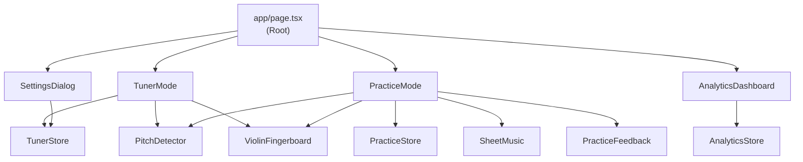
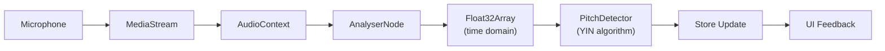
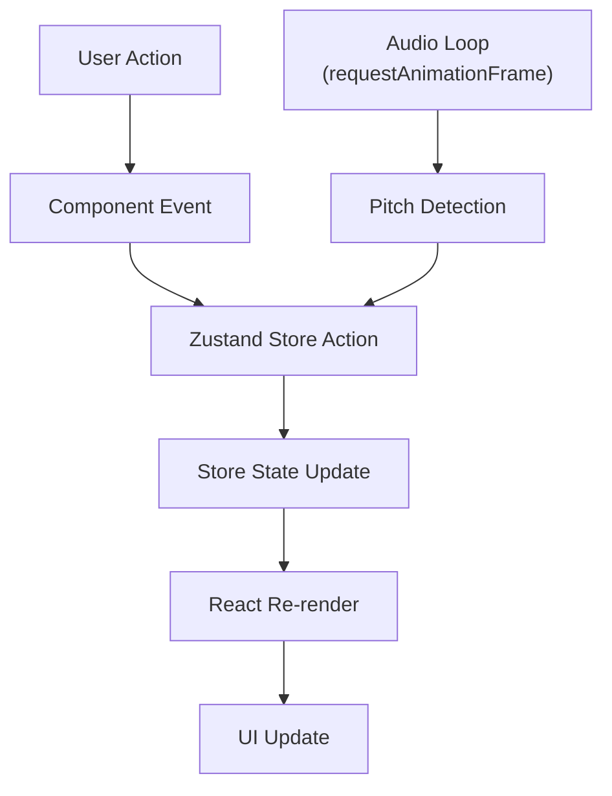

# Violin Mentor Architecture

## High-Level Overview

Violin Mentor is a client-side Next.js application with three distinct operational modes that share common audio infrastructure and state management.

### Mode Architecture

The application operates in exactly one mode at a time, controlled by local React state in the root page component. [1](#0-0)

Mode switching is handled by a Radix UI tabs component that renders the appropriate mode component: [2](#0-1)

### Component Hierarchy

## Data Flow

### Audio Pipeline

**Implementation locations**:
- Audio initialization: [3](#0-2)
- Pitch detection loop: [4](#0-3)
- YIN algorithm: [5](#0-4)

### State Management Flow

The application uses three independent Zustand stores:
- **TunerStore**: Manages tuner mode state and audio resources
- **PracticeStore**: Manages practice sessions and exercise progression
- **AnalyticsStore**: Persists session history and user progress [6](#0-5) [7](#0-6) [8](#0-7)

### Cross-Store Interactions

Only the **PracticeStore** interacts with the **AnalyticsStore**:

1. Session start: [9](#0-8)
2. Note attempts: [10](#0-9)
3. Note completions: [11](#0-10)
4. Session end: [12](#0-11)

The **TunerStore** operates independently and does not record analytics.

## Runtime Boundaries

### Client-Side Only

All audio processing and pitch detection occurs client-side. There are no server-side API endpoints for audio processing. [13](#0-12) [14](#0-13)

### Audio Resource Management

Each mode that requires audio (Tuner and Practice) manages its own audio resources:

**Tuner Mode initialization**: [15](#0-14)

**Practice Mode initialization**: [16](#0-15)

**Critical invariant**: Audio resources (MediaStream, AudioContext) must be cleaned up when switching modes or on errors to prevent resource leaks.

**Tuner cleanup**: [17](#0-16)

**Practice cleanup**: [18](#0-17)

## Mode Switching Behavior

When switching between modes:
1. Previous mode's component unmounts
2. Audio resources are automatically cleaned up via store reset
3. New mode's component mounts
4. User must explicitly initialize audio (microphone permission required)

**UNKNOWN**: Whether audio resources persist if user switches modes while audio is active
**WHY IT MATTERS**: Could cause resource leaks or permission issues
**HOW TO CONFIRM**: Test switching from Tuner (active) → Practice → back to Tuner

## Exercise System

Exercises are defined statically in TypeScript files and processed at build time: [19](#0-18)

Categories:
- Open Strings: [20](#0-19)
- Scales: [21](#0-20)
- Songs: [22](#0-21)

MusicXML is generated from exercise data: [23](#0-22)

## Analytics Persistence

The AnalyticsStore uses Zustand's persist middleware to store session history and progress in browser localStorage: [24](#0-23)

Persistence configuration: [25](#0-24)

**Storage key**: `violin-analytics`
**Persisted fields**: `sessions` (last 100), `progress`
**Not persisted**: `currentSession` (session-only state)
